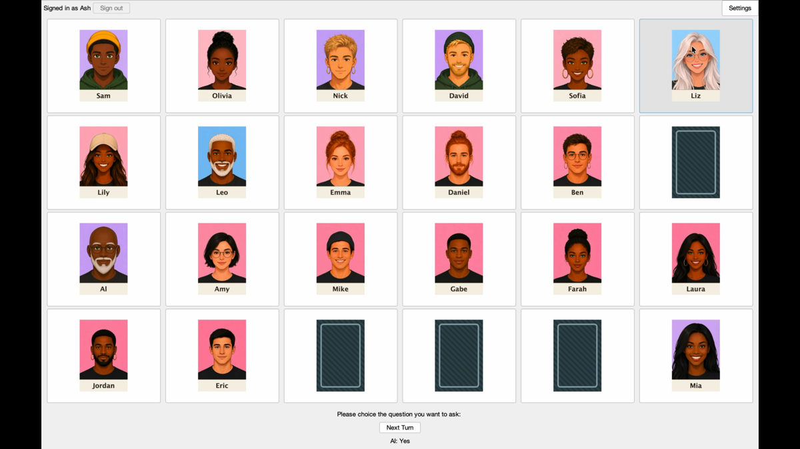

# Guess Who Board Game

A desktop adaptation of Guess Who built with Java, Swing, and Spring Boot.
Play locally against another person or the computer, or sign in and challenge a
friend online with a six-character room code.

## Demo

[](https://youtu.be/HXcnNW5vhzs)

[Watch the Guess Who v2.0 demo on YouTube](https://youtu.be/HXcnNW5vhzs)

The v2 walkthrough demonstrates account status, game setup, player-versus-
computer gameplay, the leaderboard, in-game help, the character guide, and
returning home without restarting the application.

## Highlights

### Play your way

- Player versus computer with easy and hard AI
- Local two-player games on one computer
- Online games against a friend using a room code
- Preset questions or free-form questions
- Interactive boards for tracking eliminated characters
- Automatic local saves with resume on the next launch

### Online play that survives real networks

- Account-backed online games and leaderboards
- Automatic recovery after a dropped connection
- A three-minute turn timer that distinguishes thinking from disconnection
- Resumable online rooms after closing and reopening the app
- Character commitments and post-game answer review to make dishonest answers
  visible

### A complete desktop experience

- Native macOS and Windows installers with a bundled Java runtime
- Persistent account status in the application header
- Three separate leaderboards for computer, local, and online games
- Settings for music, rules, the character reference, and returning home
- Background music with persistent volume, mute, and playback controls
- Completed results queued locally while the server is unavailable

### Defensive by design

- Versioned client/server API with clear outdated-client errors
- Rate limits for authentication, room creation, and moves
- Transactional game-result storage and Flyway database migrations
- Idempotent online moves and player-specific room projections
- No opponent character sent to a client before the reveal

## Install

Download the installer for your system from the
[releases page](https://github.com/greninjam26/Guess-Who-boardgame/releases).
Java is included.

The published v1 installers support local play and expect a server on the same
computer. The v2 candidates connect to the public server and will replace them
after the remaining release checks pass and `v2.0.0` is tagged.

### macOS — Apple silicon

Open the `.dmg` and drag **Guess Who** to Applications. The app is not notarized,
so macOS may block a normal double-click. Control-click the app, choose **Open**,
and confirm the warning. If macOS still blocks it, open **System Settings →
Privacy & Security** and choose **Open Anyway** for Guess Who.

If **Open Anyway** is unavailable, first confirm the DMG came from this
repository's release page, then clear quarantine from this app only:

```bash
xattr -dr com.apple.quarantine '/Applications/Guess Who.app'
```

This does not disable Gatekeeper for any other application.

### Windows

Run the `.msi`. If SmartScreen warns about an unfamiliar application, choose
**More info**, then **Run anyway**. The installer is not code-signed.

### Linux

There is no Linux installer because `jpackage` creates only the native format of
the operating system running it. Use the development instructions below.

### Local application data

| System  | Location                                  |
| ------- | ----------------------------------------- |
| macOS   | `~/Library/Application Support/Guess Who` |
| Windows | `%APPDATA%\Guess Who`                     |
| Linux   | `~/.local/share/guess-who`                |

## Play Online

The public demo server is available at
<https://greninja-guesswho.duckdns.org> and is scheduled to be removed by
2027-02-26.

Both players must be signed in. One chooses **Play online against a friend** and
**Start a game and get a code**; the other chooses **Join with a code** and
enters it. Room codes are case-insensitive and may contain a space when typed.

Rooms expire after ten minutes without a second player, thirty minutes of
inactivity, or twenty-four hours total.

## Development Quick Start

Requirements:

- JDK 17 or newer
- Apache Maven

Build and test everything:

```bash
mvn clean package
mvn test
```

Run the desktop client:

```bash
mvn install -DskipTests
mvn -pl desktop-client exec:java
```

Run the development server:

```bash
mvn -pl server spring-boot:run
```

Local builds use `http://localhost:8080`. Point a client at another server with
the `guesswho.server.url` system property:

```bash
mvn -pl desktop-client exec:java -Dexec.args="" \
  -Dguesswho.server.url=https://games.example
```

See [Development Guide](docs/DEVELOPMENT.md) for installer builds, the full
project structure, API examples, configuration, and the main-class reference.

## Architecture

The Maven build contains three modules:

| Module           | Responsibility                                      |
| ---------------- | --------------------------------------------------- |
| `game-core`      | Rules, domain models, character data, and artwork   |
| `desktop-client` | Swing interface, persistence, and HTTP clients      |
| `server`         | Spring Boot API, online rooms, accounts, and storage |

`game-core` has no Spring, Swing, or HTTP dependency. Both applications depend
on it, which keeps server and database libraries out of the desktop installer.

The deployed v2 service is one deliberately small Spring Boot monolith with
PostgreSQL on a single EC2 instance behind Caddy. This is enough for a personal
demo and avoids infrastructure whose cost and complexity the project does not
need.

## Technology

- Java 17, Swing, and AWT
- Spring Boot 4.1.1 and Spring MVC
- Spring JDBC and Flyway
- H2 for development and PostgreSQL 15 in production
- Maven and `jpackage`
- AWS EC2, Caddy, S3, Systems Manager, and GitHub Actions
- CSV-based character and question data

## Documentation

| Document | Contents |
| -------- | -------- |
| [Documentation index](docs/README.md) | Guide to all project documentation |
| [Development Guide](docs/DEVELOPMENT.md) | Build, run, test, package, and API reference |
| [Architecture](docs/ARCHITECTURE.md) | Boundaries, persistence, security, and deployment decisions |
| [Roadmap](docs/ROADMAP.md) | Release history, remaining v2 checks, and later phases |
| [AWS deployment](deploy/aws/README.md) | Public-host deployment and operations |
| [Installer packaging](packaging/README.md) | Native packages, icons, and release endpoint rules |

## Release Status and Limitations

v2.0 code is complete, but the release still requires final acceptance work:

- install and smoke-test the post-UI Windows candidate
- play a two-client game from two networks with a server restart during play
- restore a backup containing real game and question data
- add accepted-build screenshots
- tag `v2.0.0`

Neither installer is code-signed, so both operating systems warn on first use.
The background music is generated rather than recorded and is intentionally a
short, simple loop.

The [Roadmap](docs/ROADMAP.md) is the source of truth for release acceptance and
post-v2 work.

## Data and Assets

- `GuessWhoDB.csv` defines the 24 characters and their attributes.
- `QuestionDB.csv` defines the preset yes-or-no questions.
- Character artwork is original to this project and stored under
  `game-core/src/main/resources/images`.
- Background music is generated by `tools/BackgroundTrack.java` and packaged
  under `game-core/src/main/resources/audio`.
- Database migrations live under `server/src/main/resources/db/migration`.

## License

The source code is released under the [MIT License](LICENSE).

The character artwork was generated from the original prompts in
[tools/character-prompts.md](tools/character-prompts.md); it does not come from
the printed board game. The legal status of machine-generated images remains
unsettled in several jurisdictions and they may not attract copyright.

“Guess Who?” is a trademark of Hasbro. This unaffiliated personal project is not
endorsed by or associated with Hasbro.
